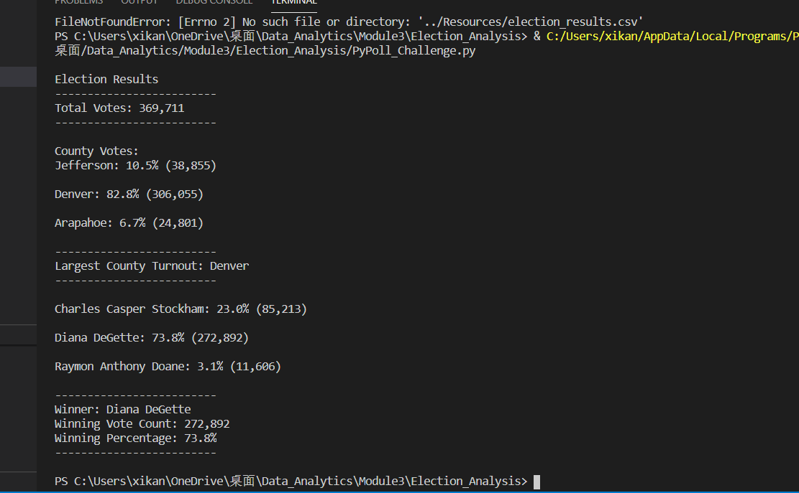

# Election_Analysis

## Overview of Election Audit
In this election analysis, We are forcused on the result of turnout for each county and use python script to count turnout and percentage of votes each county has with the winning county which has the highest turnout by printing the result to the text file. Our goal here is to deliver all the results by using python script which are accurate and efficient and it can also be applied to other election count purpose by some simple modifications. We are not struggling on countting each votes anymore, we can forcus on the analysis of the election result by a simple click.

## Election Audit Results

* As we can see from above image, there are totally 369,711 votes in this congressional election.

* All three counties and votes details have listed below:
  * Jefferson: Vote Percentage-10.5%, Number of votes: 38,855
  * Denver: Vote Percentage-82.8%,Number of votes: 306,055
  * Arapahoe: Vote Percentage-6.7%,Number of votes：24,801

* Denver is the county which has the largest number of votes.

* All three candidates and votes details have listed below:
  * Charles Casper Stockham:Vote Percentage-23.0%, Number of votes: 85,213
  * Diana DeGette:Vote Percentage-73.8%, Number of votes: 272,892
  * Raymon Anthony Doane:Vote Percentage-3.1%, Number of votes: 11,606

* The candidate who has won the election is Diana DeGetter and he has 272,892 votes which is 73.8% of the total votes.

## Election Audit Summary
Since all other elections have the similiar mode to count the votes and calculate the vote percentage, we could applied our model to other election by some modifications. All we need to change is the name of the parameter and the print statement. For example, if we are having a team leader election and we have five candidates. After imporint the new data, we are going to read data from each row and save the values to our new dictionary with the "key" candidate name and "value" number of votes for each of them. By using the same code we can easily have the election result with the number of votes, vote percentage and the winning candidate by modifying the print statment. The same idea can also applied for election of the favortie sutdent in the class. We can have the potential candidate with their vote saved in the dictionary by reading the data from the Excel worksheet, we can also have the statistical data with the number of votes and vote percentage for each candidate by using the same python code. we could easily have the result printed on the screen or saved in the result text file. Overall, the countting and calculation process are the same, this program can be used for any other election by changing the variable names, print statement accordingly.

